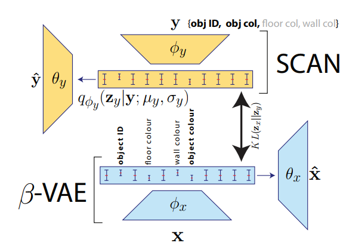

# SCAN in Tensorflow
A Tensorflow implementation of DeepMind's Symbol-Concept Association Network([SCAN: Learning Abstract Hierarchical Compositional Visual Concepts](https://arxiv.org/abs/1707.03389))

